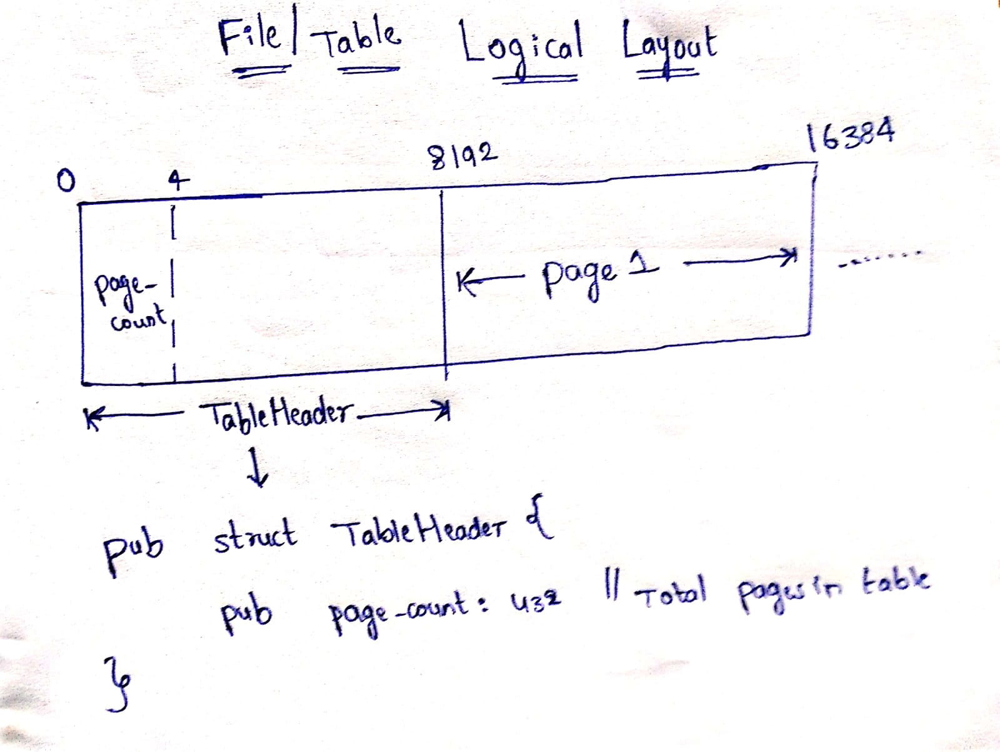

<h2 align="center">
RookDB - Storage Manager Design Doc
</h2>

### Catalog Layout
```bash
database/
  ├── global/
  │   └── catalog.json
  └── base/
      ├── db1/
      │   └── {table}.dat
      ├── db2/
      │   └── {table}.dat
```

### Storage Paths
```rust
pub const DATA_DIR: &str = "database"; // Root directory for all storage
pub const CATALOG_DIR: &str = "database/global"; // Catalog metadata directory
pub const CATALOG_FILE: &str = "database/global/catalog.json"; // Global catalog file
pub const DATABASE_DIR: &str = "database/base"; // Root directory for all databases
pub const TABLE_DIR_TEMPLATE: &str = "database/base/{database}"; // Directory for specific database
pub const TABLE_FILE_TEMPLATE: &str = "database/base/{database}/{table}.dat"; // File path for specific table
```

### Catalog Data Structures
```rust
#[derive(Serialize, Deserialize)]
pub struct Column {
    pub name: String,
    pub data_type: String,
}

#[derive(Serialize, Deserialize)]
pub struct Table {
    pub columns: Vec<Column>,
}

#[derive(Serialize, Deserialize)]
pub struct Database {
    pub tables: HashMap<String, Table>,
}

#[derive(Serialize, Deserialize)]
pub struct Catalog {
    pub databases: HashMap<String, Database>,
}
```

### Example Catalog File
```json
{
  "databases": {
    "main": {
      "tables": {
        "users": {
          "columns": [
            { "name": "id", "data_type": "INT" },
            { "name": "username", "data_type": "TEXT" },
            { "name": "email", "data_type": "TEXT" }
          ]
        },
        "orders": {
          "columns": [
            { "name": "order_id", "data_type": "INT" },
            { "name": "user_id", "data_type": "INT" },
            { "name": "amount", "data_type": "FLOAT" }
          ]
        }
      }
    },
    "analytics": {
      "tables": {
        "events": {
          "columns": [
            { "name": "event_id", "data_type": "INT" },
            { "name": "timestamp", "data_type": "TIMESTAMP" },
            { "name": "type", "data_type": "TEXT" }
          ]
        }
      }
    }
  }
}
```

### File and Page Layout



### Table - Physical Layout
```rust
pub struct Table {
    pub data: Vec<u8>, // Fixed-size buffer holds the raw bytes of a table.
}
```

### Table - Logical Layout
```rust
pub const TABLE_HEADER_SIZE: u32 = 8192;

pub struct TableHeader {
    pub page_count: u32, // Total Number of Pages in a Table
}

pub struct Table {
    pub table_header: TableHeader,
    // Pages are laid out consecutively after the table header on disk
}
```

### Page - Physical Layout
```rust
pub const PAGE_SIZE: usize = 8192;

pub struct Page {
    pub data: Vec<u8>  // Fixed-size buffer holds the raw bytes of a page (PAGE_SIZE = 8KB)
}
```

### Page Header
```rust
pub const PAGE_HEADER_SIZE: u32 = 8; // Page Header Size - 8 bytes (4 for lower, 4 for upper)

pub struct PageHeader {
    pub lower: u32,   // Offset to start of free space - 4 bytes
    pub upper: u32,   // Offset to end of free space - 4 bytes
}
```

### Item/Tuple Details
```rust
pub const ITEM_ID_SIZE: u32  = 8;

pub struct ItemId {
    pub offset: u32, // Offset of the item/tuple
    pub length: u32, // Length of the item/tuple
}
```
### **Logical Page Layout**
```rust
pub struct Page {
    pub header: PageHeader,
    pub item_id_data: Vec<ItemId>,
    // Tuples and their metadata are organized within the page after the header
}
```

* **Table** and **File** are used interchangeably in the document. Both Represent same.
---

## Currently Implemented API's
0. Init Catalog
1. Load Catalog
2. Create Database
3. Show Databases
4. Select Database
5. Show Tables
6. Save Catalog
7. Create Table
8. Init Table
9. Init Page
10. Page Count
11. Create Page
12. Read Page
13. Write Page
14. Page Free Space
15. Add Tuple to Page

## Ongoing API's

2. Read Item/Get Tuple
3. Delete Item
4. Compact Page
5. Search in Table for Tuple
6. Drop Table
7. Lookup Table

---
## Completed APIs with Test Cases
### 0. **init_catalog** API

**Description:**  
Creates `catalog.json` if it doesn’t exist and initializes it with an empty catalog (`{ "tables": {} }`).

**Function:**  
```rust
pub fn init_catalog()
```

**Implementation:**
1. Check if database/global/catalog.json exists.
2. If not, create parent directories and an empty file with data **{ "tables": {} }**.

**Test Case:**
1. Run init_catalog().
2. Verify file is created with valid JSON.

### 1. **load_catalog** API

**Description:**  
* Loads the catalog table metadata into memory as a **Catalog struct**.

**Function:**  
```rust
pub fn load_catalog() -> Catalog
```
**Ouput:**
*  Returns a valid Catalog struct containing table metadata.

**Implementation:**
* Reads the catalog file, validates its contents, and deserializes it into a Catalog struct.

**Test Case:**
* Call load_catalog() API and verify it returns a valid Catalog instance without errors.

### 2. **create_database** API

**Description:**  
* Creates a new database in the catalog.

**Function:**  
```rust
pub fn create_database(catalog: &mut Catalog, db_name: &str) -> Result<(), StorageError>
```
**Input:**
* **catalog:**	 in-memory catalog metadata.
* **db_name:**	Name of the new database to be created.

**Ouput:**
*  Returns Ok on success or an error if creation fails.

**Implementation:**
1. Check if the database already exists; if not, insert a new empty entry into catalog.databases.
2. Serialize the updated Catalog and write it to database/global/catalog.json.
3. Create a new directory at database/base/{db_name} for the database’s physical storage.

### 2. **save_catalog** API

**Description:**  
* Writes the in-memory Catalog structure (containing table metadata) back to disk in JSON format.

**Function:**  
```rust
pub fn save_catalog(catalog: &Catalog)
```

**Input:**
* catalog: A reference to a Catalog struct in memory that holds all table definitions.

**Ouput:**
* Writes the catalog data to `CATALOG_FILE`.

**Implementation:**
* Serializes the given Catalog struct into a  JSON string and writes it to the catalog file path.

**Test Case:**
1. Modify the in-memory Catalog instance by adding a new table.
2. Call save_catalog(&catalog) and verify that the number of tables has increased by one compared to the count before saving.
---

### 3. **create_table** API
**Description:**  
* Creates a new table entry in the in-memory Catalog with the provided table name and column definitions.
* If the table does not already exist, it is added to the catalog and the updated catalog is written to disk in JSON format.

**Function:**  
```rust
pub fn create_table(catalog: &mut Catalog, table_name: &str, columns: Vec<Column>) 
```

**Input:**
* catalog: A mutable reference to the in-memory Catalog structure that holds metadata for all tables.
* table_name: A string slice representing the name of the new table to be created.
* columns: A vector of Column structs, where each struct contains the column name and data type for the new table.

**Ouput:**
* Updates the in-memory Catalog by inserting the new table.
* Persists the updated catalog to disk by writing to the CATALOG_FILE in JSON format using **save_catalog** API.

**Implementation:**
* Checks if a table with the given name already exists in the catalog.
* If not, creates a new Table struct using the provided columns.
* Inserts the table into the catalog.tables HashMap.
* Calls save_catalog(catalog) to serialize and write the updated catalog to disk.
* Creates a new data file for the table in {TABLE_DIR}/{table_name}.dat.
* Initializes the table file header by writing TABLE_HEADER_SIZE bytes of zeros using init_table().
---

### 4. **init_table** API
**Description:**

* Initializes the **Table Header** by writing the **first page** (8192 bytes) into the table file with 0's. The first 4 bytes represent the **Page Count** (0).

**Function:**  
```rust
pub fn init_table(file: &mut File)
```
**Input:** 
`file:` File pointer to update Table Header.

**Output:** 
Table header (first page) initialized with page_count = 0 in the first 4 bytes and remaining bytes set to zero.

**Implementation:**
1. Move the file cursor to the beginning of the file.
2. Allocate a buffer of 8192 bytes (**TABLE_HEADER_SIZE**) initialized to zero.
3. Write the entire 8192-byte buffer (including the page count) to disk, marking the creation of the first table page.
4. Write another 8192-byte buffer to disk to initialize the first data page along with page headers using `create_page` API (Page 1), which will store table tuples.
**Test Case:**
1. Created a new file to simulate a fresh table.
2. Initialized the table header using **init_table** API, setting the page count to 0.
3. Verified that the file size obtained from **metadata().len()** equals **TABLE_HEADER_SIZE** (8192 bytes), confirming that the entire header page was written successfully.
---

### 5. **init_page** API
**Description:**

* Initializes the **Page Header** with two offset values for **In Memory Page**:
    - **Lower Offset** (`PAGE_HEADER_SIZE`) → bytes 0..4
    - **Upper Offset** (`PAGE_SIZE`) → bytes 4..8

**Function:**  
```rust
pub fn init_page(page:&mut Page)
```
**Input:** 
`page:` **In Memory Page** to set Header - Lower and Upper Offsets.

**Output:** 
Page header updated with lower and upper offsets.

**Implementation:**
1. Write the lower offset (`PAGE_HEADER_SIZE`) into the first 4 bytes of the page header (0..4).
2. Write the upper offset (`PAGE_SIZE`) into the next 4 bytes of the page header (4..8).

**Test Case:**
1. Created a new in-memory page with zeroed data.
2. Initialized the page header using init_page API, setting the lower and upper offsets.
3. Checked whether the first 4 bytes were **PAGE_HEADER_SIZE** and the next 4 bytes were **PAGE_SIZE**.
---

### 6.**page_count** API
**Description:**
To get total number of pages in a file

**Function:**  
```rust
pub fn page_count(file: &mut File)
```
**Input:** 
`file:` file to calculate number of pages.

**Output:** 
Total number of pages present in the file.

**Implementation:**
1. Use the **read_page()** function to read the first page (page ID 0) from the file into memory.
2. Extract the **first 4 bytes** from the in-memory page buffer — these bytes represent the page count stored in the table header.
3. Return the first 4 bytes as page count.

**Test Case:**
1. Create a temp table file.
2. Initialize it using `init_table()`.
3. Call `page_count()` to verify it correctly reads 0.
---

### 7. **create_page** API
**Description:**  
Create a page in disk for a file.

**Function:**  
```rust
pub fn create_page(file: &mut File)
```
**Input:** 
`file:` file to create to a file

**Output:** 
1. Create a page at the end of the file.
2. Update the File Header with **Page Count**.

**Implementation:**
1. Initializes a new page **in memory** using **init_page** API (update page header - lower and upper).
2. Reads the **current page count** from the file using the **page_count** API.
3. Moves the file cursor to the end of the file.
4. Writes the initialized in-memory page to the file and **updates the file header** by incrementing the page count stored in the first 4 bytes.

**Test Case:**
1. Verified using `File Size`, `Page Count` and `Page Headers` before and after creating the page using file metadata.
---

### 8. **read_page** API
**Description:**  
Reads a page from a disk/file into memory.

**Function:**  
```rust
pub fn read_page(file: &mut File, page: &mut Page, page_num: u32)
```
**Input:** 
`file:` file to read from, 
`page:` memory page to fill, 
`page_num:` page number to read

**Output:** 
Populates the given memory page with data read from the file.

**Implementation:**
1. Calculates the **offset** as **(page_num * PAGE_SIZE)** and moves the file cursor to the correct position.
2. Reads data from that offset position up to **offset + PAGE_SIZE** and copies it into the page memory.

**Cases Handled:**
1. Checks the file size and returns an error if the requested page does not exist in the file.

**Test Case:**
* Verified **read_page** API correctly reads one full page — file size equals PAGE_SIZE and data matches the original written content.
---

### 9.**write_page** API
**Description:**  
Write a page from memory to disk/file.

**Function:**  
```rust
pub fn write_page(file: &mut File, page: &mut Page, page_num: u32)
```
**Input:** 
`file:` file to write, 
`page:` memory page to copy from, 
`page_num:` page number to write

**Output:** 
Writes the contents of the given memory page to the file at the specified page offset.

**Implementation:**
1. Calculates the **offset** as `page_num * PAGE_SIZE` and moves the file cursor to the correct position.
2. copy the contents of the given memory page from offset to `offset + PAGE_SIZE` positions to the file.

**Test Case:**
* Verified **write_page** API correctly writes one full page — by using write_page wrote some content to the page and read back the same page to confirm that the written data matches exactly, and the file size is at least PAGE_SIZE.

---

### 10. **page_free_space** API
**Description:**  
To calculate the total amount of free space left in the page.

**Function:**  
```rust
pub fn page_free_space(page: &Page) 
```
**Input:** 
`page:` page to calculate the free space.

**Output:** 
Total amount of freespace left in the page.

**Implementation:**
1. Read the `lower pointer` from the first 4 bytes of the page.
2. Read the `upper pointer` from the next 4 bytes of the page.
3. Calculate `free space`  = `upper - lower`.
4. Return the free space.

**Test Case:**
* Verified that **page_free_space()** correctly calculates free space (upper - lower) for a newly created data page initialized using init_table() and create_page().
* Confirmed that the page header offsets (lower = PAGE_HEADER_SIZE, upper = PAGE_SIZE) and total page count are consistent and accurate.
---

### 11. **add_tuple** API
**Description:**
Adds raw data to the file.

**Function:**  
```rust
pub fn page_add_data(file: &mut File, data: &[u8])
```
**Input:** 
`file:` The file to which data should be added.
`data:` The raw bytes to insert into the page.

**Output:** 
Data inserted in the file.

**Implementation:**
1. Get the **total number of pages** in the file using [`page_count`](#4page_count-api) API.
2. Read the **last page** into memory using [`read_page`](#2-read_page-api) API.
3. Check **free space** in the page using [`page_free_space`](#5-page_free_space-api) API.
4. If the last page has enough free space to store the data and its ItemId 
(i.e., if `free_space >= data.size() + ITEM_ID_SIZE`):
    a. Calculate the **insertion offset** from the upper pointer.
        `start = upper - data.len()`
    b. Copy the data bytes into the page buffer starting at this offset.
    c. Update the **upper pointer** in the page header to the new start of free space.
    d. Write the **ItemId entry** (offset and length of the data) at the position indicated by the lower pointer.
    e. Update the **lower pointer** in the page header to account for the newly added ItemId (`lower += ITEM_ID_SIZE`).
    f. Write the updated page back to disk using [`write_page`](#3write_page-api) API.
5. If the last page does not have enough free space:
    a. [TODO]

<!-- ## Ongoing APIs and Implementations -->


* [Code - Github](https://github.com/hemanth-sunkireddy/Storage-Manager)
* [Code Documentation](https://hemanth-sunkireddy.github.io/Storage-Manager/storage_manager/all.html)
* **Reference 1**: API Formats – [Storage Manager Course Assignment Link](http://www.cs.iit.edu/~glavic/cs525/2023-spring/project/assignment-1/)
* **Reference 2**: [Postgres Internals – Page Layouts & Data](https://www.postgresql.org/docs/current/storage-page-layout.html)


* Support for Different page Sizes( Ex for high loads)
* Why we need a new Storage Manager? Question of this project.