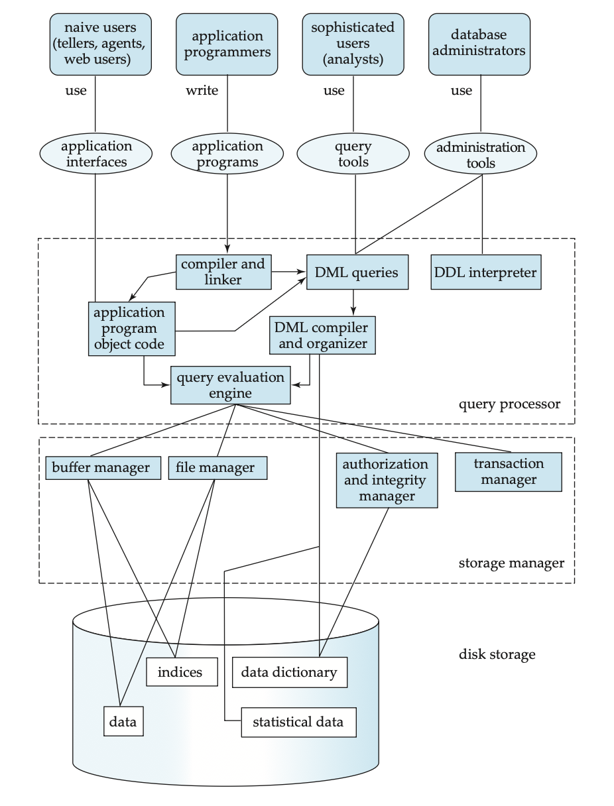

# RookDB - A Lightweight Database Storage Engine

### Key Highlights
#### Layered Storage Architecture
* RookDB is designed with clear separation between the Catalog, Database, Table, and Page layers, ensuring modularity, maintainability, and efficient data flow from schema to storage.
#### Persistent Metadata Management
* The catalog maintains structured metadata for all databases and tables, enabling consistent schema tracking and efficient object management across the system.
#### Page-Oriented Storage Model
* Data is stored in fixed-size 8KB pages with defined headers, free-space tracking, and tuple directories, providing efficient space utilization and predictable I/O performance.
#### Comprehensive Storage APIs
* Provides low-level APIs for database and table creation, page initialization, page I/O, space management, and tuple operations — forming the core of the storage engine.
#### Extensible Core Design
* Built as a lightweight and modular engine that can be extended with advanced components like buffer management, indexing, and transaction support.
---

- [Design Documentation](Design-Doc-v0.pdf)
- [Code - click here](code/)
- [Code Documentation](https://hemanth-sunkireddy.github.io/Storage-Manager/storage_manager/index.html)